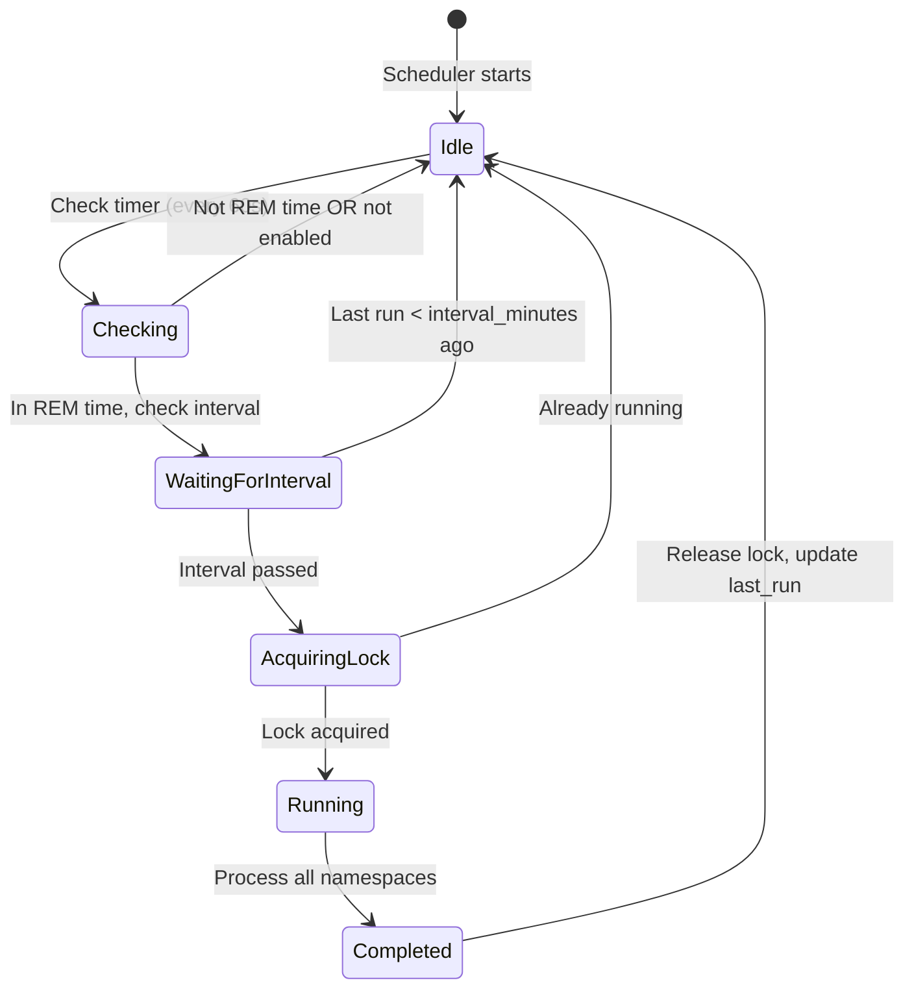
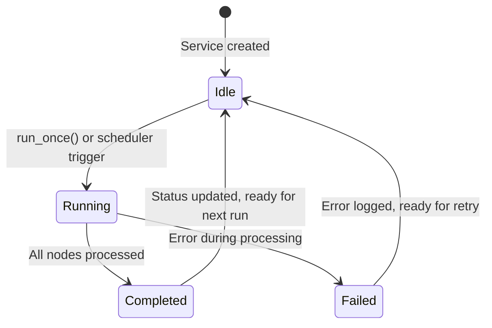

# Diagramas de Secuencia - FractalMind

Este documento describe los flujos de datos entre las fases asíncronas del sistema FractalMind usando diagramas de secuencia UML.

## Arquitectura Dual-Fase

FractalMind opera en dos fases complementarias que imitan la cognición humana:

- **Vigilia (Wakefulness)**: Respuestas en tiempo real a consultas usando navegación fractal
- **Fase REM (Sleep)**: Aprendizaje asíncrono, consolidación de memoria e integración de conocimiento

---

## 1. Fase de Vigilia - Consulta con Ask

```mermaid
sequenceDiagram
    autonomous
    participant Client
    participant API as API Handler
    participant Brain as ModelBrain
    participant NodeRepo as NodeRepository
    participant EdgeRepo as EdgeRepository
    participant Cache as LRU Cache
    participant SSSP as SSSP Algorithm

    Client->>API: POST /v1/ask (question)
    activate API
    
    API->>Brain: embed(question)
    activate Brain
    Brain-->>API: query_embedding (768D)
    deactivate Brain
    
    API->>NodeRepo: search_similar(embedding, namespace, limit=10)
    activate NodeRepo
    NodeRepo-->>API: Vec<(FractalNode, similarity)>
    deactivate NodeRepo
    
    API->>EdgeRepo: check_fractal_structure()
    activate EdgeRepo
    EdgeRepo-->>API: has_edges: bool
    deactivate EdgeRepo
    
    alt Has Fractal Structure AND results > 1
        API->>SSSP: compute_shortest_paths(graph, start_node)
        activate SSSP
        SSSP-->>API: distances + paths
        deactivate SSSP
        
        API->>API: Rank: 70% vector_sim + 30% graph_proximity
    else No Fractal Structure
        API->>API: Filter by similarity threshold (≥0.4)
    end
    
    API->>Brain: chat_with_system(system_prompt, question)
    activate Brain
    Brain-->>API: answer (LLM response)
    deactivate Brain
    
    API-->>Client: {answer, sources[], latency_ms}
    deactivate API
```

### Detalle de Navegación SSSP

```mermaid
sequenceDiagram
    autonomous
    participant API as API Handler
    participant Graph as Local Graph
    participant EdgeRepo as EdgeRepository
    participant NodeRepo as NodeRepository
    participant SSSP as SSSP Algorithm

    API->>API: Filter results by threshold (≥0.4)
    
    loop For each filtered node
        API->>Graph: add_node(node_id, namespace)
    end
    
    loop For each leaf node
        API->>EdgeRepo: get_incoming(node_id)
        activate EdgeRepo
        EdgeRepo-->>API: Vec<incoming_edges>
        deactivate EdgeRepo
        
        loop For each parent edge
            API->>NodeRepo: get_by_id(parent_id)
            activate NodeRepo
            NodeRepo-->>API: parent_node
            deactivate NodeRepo
            
            API->>Graph: add_node(parent_id, parent.namespace)
            API->>API: Calculate parent_similarity = edge.similarity * 0.9
        end
    end
    
    loop For each explored node
        API->>EdgeRepo: get_outgoing(node_id)
        activate EdgeRepo
        EdgeRepo-->>API: Vec<outgoing_edges>
        deactivate EdgeRepo
        
        loop For each outgoing edge
            alt Target node in graph
                API->>Graph: add_edge(from, to, similarity)
            end
        end
    end
    
    API->>SSSP: compute(graph, best_start_node)
    activate SSSP
    SSSP-->>API: {distances: Map<node_id, f32>, paths: Map<node_id, Vec<node_id>>}
    deactivate SSSP
    
    API->>API: Combined Score = sim * 0.7 + (1.0/(1.0+distance)) * 0.3
    API->>API: Sort by combined_score DESC
    API->>API: Take top N results
```

---

## 2. Fase REM - Consolidación Automática

```mermaid
sequenceDiagram
    autonomous
    participant Scheduler as REM Scheduler
    participant NodeRepo as NodeRepository
    participant FractalBuilder as FractalBuilder
    participant Raptor as RAPTOR Algorithm
    participant Brain as ModelBrain
    participant EdgeRepo as EdgeRepository
    participant DB as SurrealDB

    par Scheduled Check (every 60s)
        Scheduler->>Scheduler: is_rem_time()? (2AM-6AM)
        Scheduler->>Scheduler: is_enabled()?
        
        alt In REM window AND enabled
            Scheduler->>Scheduler: Check last_run interval (≥30 min)
            Scheduler->>Scheduler: Check is_running (mutex)
            
            note over Scheduler: Acquire running lock
            Scheduler->>Scheduler: set is_running = true
            
            loop For each namespace
                Scheduler->>NodeRepo: get_by_namespace(namespace)
                activate NodeRepo
                NodeRepo-->>Scheduler: Vec<FractalNode>
                deactivate NodeRepo
                
                Scheduler->>Scheduler: Filter leaf_nodes (depth_level == 0)
                Scheduler->>Scheduler: Take max 100 nodes
                
                alt leaf_nodes >= 3
                    Scheduler->>FractalBuilder: new(config)
                    Scheduler->>FractalBuilder: build_for_namespace(namespace, brain)
                    activate FractalBuilder
                    
                    FractalBuilder->>NodeRepo: fetch_leaf_nodes(namespace)
                    activate NodeRepo
                    NodeRepo-->>FractalBuilder: Vec<leaf_nodes>
                    deactivate NodeRepo
                    
                    FractalBuilder->>FractalBuilder: Convert to RaptorNodes
                    
                    FractalBuilder->>Raptor: build_tree(raptor_nodes)
                    activate Raptor
                    Raptor-->>FractalBuilder: RaptorTree
                    deactivate Raptor
                    
                    FractalBuilder->>FractalBuilder: Process by depth (bottom-up)
                    
                    loop For each cluster at depth
                        alt Summaries enabled AND brain available
                            FractalBuilder->>Brain: simple_chat(summarization_prompt)
                            activate Brain
                            Brain-->>FractalBuilder: summary_text
                            deactivate Brain
                        end
                        
                        FractalBuilder->>FractalBuilder: create_parent_node(summary, depth)
                        FractalBuilder->>NodeRepo: create(parent_node)
                        activate NodeRepo
                        NodeRepo-->>FractalBuilder: parent_id
                        deactivate NodeRepo
                        
                        loop For each child
                            FractalBuilder->>FractalBuilder: calc_similarity(parent, child)
                            FractalBuilder->>EdgeRepo: create(FractalEdge parent->child)
                            activate EdgeRepo
                            EdgeRepo-->>FractalBuilder: edge_id
                            deactivate EdgeRepo
                        end
                    end
                    
                    FractalBuilder->>FractalBuilder: create_sibling_edges()
                    
                    FractalBuilder-->>Scheduler: FractalBuildResult
                    deactivate FractalBuilder
                    
                    Scheduler->>Scheduler: Log: processed, created, clusters
                else Not enough nodes
                    Scheduler->>Scheduler: Skip clustering
                end
            end
            
            note over Scheduler: Release running lock
            Scheduler->>Scheduler: set is_running = false
            Scheduler->>Scheduler: set last_run = now()
            
            Scheduler->>Scheduler: Emit info log
        end
    end
```

---

## 3. Ingesta de Archivos con Chunking

```mermaid
sequenceDiagram
    autonomous
    participant Client
    participant API as API Handler
    participant Multipart as Multipart Parser
    participant Extractor as ContentExtractor
    participant Chunker as TextChunker
    participant Brain as ModelBrain
    participant Cache as EmbeddingCache
    participant NodeRepo as NodeRepository
    participant FractalBuilder as FractalBuilder

    Client->>API: POST /v1/ingest/file (multipart: file, namespace, tags, language)
    activate API
    
    loop Parse multipart fields
        API->>Multipart: next_field()
        Multipart-->>API: Field (file/namespace/tags/language)
    end
    
    API->>API: Validate file_size (< max_file_size)
    API->>API: Detect file_type (PDF/Image/Text)
    
    alt File type supported AND features enabled
        API->>Extractor: extract(file_bytes)
        activate Extractor
        Extractor-->>API: ExtractionResult (text, metadata)
        deactivate Extractor
        
        API->>Chunker: chunk(extracted_text)
        activate Chunker
        Chunker-->>API: ChunkingResult (chunks[], count, avg_size)
        deactivate Chunker
        
        API->>API: Initialize created_node_ids = []
        
        loop For each chunk
            API->>Brain: embed(chunk.content)
            activate Brain
            Brain-->>API: embedding (768D)
            deactivate Brain
            
            API->>Cache: put(chunk.content, embedding)
            API->>API: Create FractalNode (chunk metadata)
            API->>NodeRepo: create(node)
            activate NodeRepo
            NodeRepo-->>API: node_id
            deactivate NodeRepo
            
            API->>API: Push node_id to created_node_ids
        end
        
        alt chunks > 0 (auto-build fractal)
            API->>FractalBuilder: new(config.with_summaries(false).with_min_nodes(3))
            API->>FractalBuilder: build_for_namespace(namespace, brain)
            activate FractalBuilder
            FractalBuilder-->>API: FractalBuildResult
            deactivate FractalBuilder
        end
        
        API-->>Client: {success, node_id (first), latency_ms, message}
    else Unsupported file or disabled
        API-->>Client: Error (ValidationError)
    end
    
    deactivate API
```

---

## 4. Sincronización REM Manual (/v1/sync_rem)

```mermaid
sequenceDiagram
    autonomous
    participant Client
    participant API as API Handler
    participant NodeRepo as NodeRepository
    participant FractalBuilder as FractalBuilder
    participant Brain as ModelBrain
    participant Raptor as RAPTOR Algorithm

    Client->>API: POST /v1/sync_rem (namespace, max_nodes, enable_clustering)
    activate API
    
    API->>NodeRepo: get_by_namespace(namespace)
    activate NodeRepo
    NodeRepo-->>API: Vec<FractalNode>
    deactivate NodeRepo
    
    API->>API: Filter leaf_nodes (depth_level == 0)
    API->>API: Take max_nodes (default: 100)
    
    alt enable_clustering AND leaf_nodes >= 3
        API->>FractalBuilder: new(config.with_summaries(true).with_min_nodes(3))
        API->>FractalBuilder: build_for_namespace(namespace, brain)
        activate FractalBuilder
        
        FractalBuilder->>FractalBuilder: fetch_leaf_nodes()
        FractalBuilder->>Raptor: build_tree(leaf_nodes)
        activate Raptor
        Raptor-->>FractalBuilder: RaptorTree
        deactivate Raptor
        
        loop For each cluster (depth 1 to max_depth)
            alt Summaries enabled
                FractalBuilder->>Brain: simple_chat(summarize combined_content)
                activate Brain
                Brain-->>FractalBuilder: summary
                deactivate Brain
            end
            
            FractalBuilder->>FractalBuilder: Create parent_node
            FractalBuilder->>FractalBuilder: Create edges parent->children
        end
        
        FractalBuilder-->>API: {parent_nodes_created, edges_created, max_depth}
        deactivate FractalBuilder
        
        API->>API: Log clustering results
    else Clustering disabled OR insufficient nodes
        API->>API: Skip fractal build
    end
    
    API-->>Client: {success, nodes_processed, nodes_created, clusters_formed, latency_ms}
    deactivate API
```

---

## 5. Búsqueda con SSSP (/v1/search)

```mermaid
sequenceDiagram
    autonomous
    participant Client
    participant API as API Handler
    participant Brain as ModelBrain
    participant NodeRepo as NodeRepository
    participant EdgeRepo as EdgeRepository
    participant Graph as Local Graph
    participant SSSP as SSSP Algorithm

    Client->>API: POST /v1/search (query, namespace, limit, threshold)
    activate API
    
    API->>Brain: embed(query)
    activate Brain
    Brain-->>API: query_embedding
    deactivate Brain
    
    API->>NodeRepo: search_similar(embedding, namespace, limit*2)
    activate NodeRepo
    NodeRepo-->>API: Vec<(FractalNode, similarity)>
    deactivate NodeRepo
    
    API->>EdgeRepo: get_edges_count()
    activate EdgeRepo
    EdgeRepo-->>API: has_fractal_structure: bool
    deactivate EdgeRepo
    
    alt has_fractal_structure AND results > 1
        API->>API: Filter results by threshold (≥0.5)
        
        loop Add filtered nodes to graph
            API->>Graph: add_node(node_id, namespace)
        end
        
        loop For each node
            API->>EdgeRepo: get_incoming(node_id)
            activate EdgeRepo
            EdgeRepo-->>API: Vec<parent_edges>
            deactivate EdgeRepo
            
            loop For each parent
                API->>NodeRepo: get_by_id(parent_id)
                activate NodeRepo
                NodeRepo-->>API: parent_node
                deactivate NodeRepo
                
                API->>Graph: add_node(parent_id)
                API->>Graph: add_edge(node_id -> parent_id, similarity*0.9)
            end
        end
        
        API->>API: Find best_start_node (highest similarity leaf)
        API->>SSSP: compute(graph, start_node)
        activate SSSP
        SSSP-->>API: {distances, paths}
        deactivate SSSP
        
        loop For each node in results
            API->>API: combined_score = similarity*0.7 + (1/(1+distance))*0.3
        end
        
        API->>API: Sort by combined_score DESC
        API->>API: Take top N results
        API->>API: Reconstruct paths from SSSP
    else No fractal structure
        API->>API: Filter by threshold, take top N
    end
    
    API-->>Client: {success, results[], total, latency_ms, used_sssp: true/false}
    deactivate API
```

---

## 6. REM Phase con Búsqueda Web (Extendido)

```mermaid
sequenceDiagram
    autonomous
    participant REM as REM Phase Service
    participant Config as RemPhaseConfig
    participant NodeRepo as NodeRepository
    participant Search as WebSearchProvider
    participant Brain as ModelBrain
    participant NodeCache as NodeCache

    REM->>Config: Check enable_web_search
    REM->>Config: Get batch_size, max_nodes_per_run
    
    REM->>NodeRepo: get_incomplete_nodes()
    activate NodeRepo
    NodeRepo-->>REM: Vec<FractalNode (status=incomplete)>
    deactivate NodeRepo
    
    REM->>REM: Filter nodes (take max_nodes_per_run)
    
    loop For each incomplete node (up to batch_size)
        REM->>REM: Create search_query (first 100 chars, 10 words)
        REM->>Search: search(query, max_results)
        activate Search
        Search-->>REM: SearchResponse (results[], latency_ms)
        deactivate Search
        
        alt Search successful
            REM->>REM: Combine snippets from results
            REM->>REM: Create SynthesizedNode:
            note over REM: - Combined content<br>- Sources URLs<br>- Related to original node
            
            REM->>Brain: embed(synthesized_content)
            activate Brain
            Brain-->>REM: embedding
            deactivate Brain
            
            REM->>REM: Create FractalNode (namespace=global_knowledge)
            REM->>NodeCache: Cache node
        else Search failed
            REM->>REM: Log warning, skip node
        end
    end
    
    alt enable_clustering AND new_nodes >= 2
        REM->>REM: Run RAPTOR clustering
        REM->>REM: Update clusters_formed count
    end
    
    REM->>REM: Emit RemPhaseResult:
    note over REM: - incomplete_nodes_found<br>- nodes_processed<br>- nodes_created<br>- clusters_formed<br>- search_stats
```

---

## 7. Flujo de Datos entre Namespaces

```mermaid
sequenceDiagram
    autonomous
    participant UserScope as user_alice (Private)
    participant GlobalScope as global_knowledge (Public)
    participant CrossLink as Cross-Namespace Linker
    participant REM as REM Phase

    par Vigilia - Query from User
        UserScope->>UserScope: search_similar(query_embedding)
        
        alt Need more context
            UserScope->>GlobalScope: Traverse via cross-namespace edges
            GlobalScope-->>UserScope: Related global knowledge
        end
        
        UserScope->>UserScope: Merge and rank results
    end
    
    par REM - Consolidation
        REM->>UserScope: Detect incomplete nodes
        REM->>GlobalScope: Synthesize new knowledge
        
        REM->>CrossLink: create_cross_namespace_edges(user, global)
        activate CrossLink
        CrossLink->>CrossLink: Find semantic matches
        CrossLink->>CrossLink: Create edges user_node <-> global_node
        CrossLink-->>REM: cross_links_created
        deactivate CrossLink
    end
```

---

## Estados del Sistema

### REM Scheduler States



### REM Phase Service States



---

## Métricas y Performance

### Complejidad Algorítmica

| Operación | Complejidad | Notas |
|-----------|-------------|-------|
| Embed query | O(n) | n = embedding dimension (768) |
| HNSW vector search | O(log N) | N = nodes in namespace |
| SSSP with hopset | O(m log^(2/3) n) | m=edges, n=nodes |
| RAPTOR clustering | O(n²) | Pairwise similarity |
| Fractal build | O(n * d) | d = max depth levels |

### Latencias Típicas

| Operación | Latencia | Factores |
|-----------|----------|----------|
| /v1/ask (no fractal) | 100-500ms | Embedding + HNSW + LLM |
| /v1/ask (with SSSP) | 200-800ms | + graph navigation |
| /v1/ingest (text) | 50-200ms | Embedding + DB write |
| /v1/ingest/file (PDF) | 1-5s | OCR + chunking + embeddings |
| /v1/sync_rem | 5-30s | RAPTOR + LLM summaries |
| REM automático | Background | No bloquea API |

---

## Consideraciones de Diseño

### Concurrencia

- **Mutex is_running**: Previene múltiples ejecuciones simultáneas de REM
- **Arc<RwLock<T>>**: Estado compartido thread-safe
- **tokio::spawn**: Async para I/O no bloqueante

### Persistencia

- **SurrealDB file://**: Base de datos en disco (no in-memory)
- **HNSW en disco**: Índices vectoriales sin sobrecargar RAM
- **Namespaces aislados**: user_* vs global_knowledge

### Cache

- **LRU Cache**: Top-level fractal nodes (más consultados)
- **Embedding Cache**: Evita recalcular embeddings idénticos
- **Cache metrics**: Hit rate monitoreado en /v1/stats
